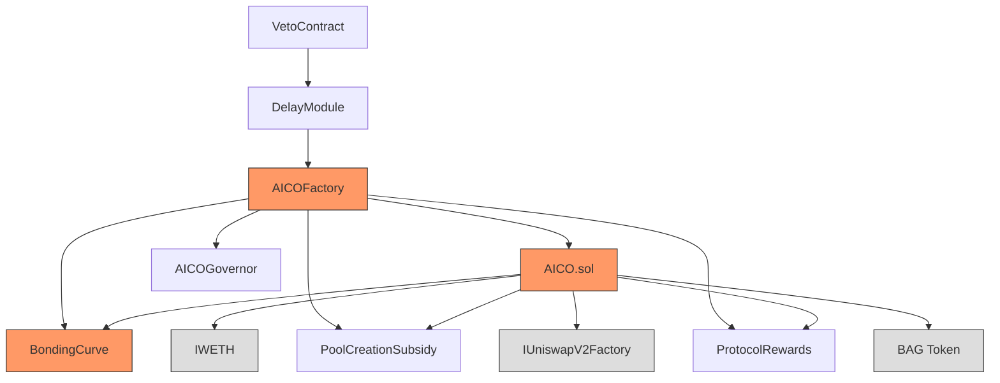

# AICO Protocol Deployment Order

## Redeployment Dependencies
If a contract needs to be redeployed, here's what else needs to be redeployed:

### BondingCurve Changes
- If BondingCurve is redeployed:
  - ⚠️ AICO.sol Implementation must be redeployed
  - ⚠️ AICOFactory must be redeployed
  - ✓ ProtocolRewards can stay the same
  - ✓ VetoContract can stay the same
  - ✓ DelayModule can stay the same
  - ✓ PoolCreationSubsidy can stay the same
  - ✓ AICOGovernor Implementation can stay the same

### AICO.sol Changes
- If AICO.sol Implementation is redeployed:
  - ⚠️ AICOFactory must be redeployed
  - ✓ All other contracts can stay the same

### Factory Changes
- If AICOFactory is redeployed:
  - ✓ No other contracts need redeployment
  - ⚠️ But all existing AICO instances will still use old factory

## Prerequisites
- BAG Token address
- UniswapV2Factory address
- WETH address
- Deployer address with sufficient ETH

## Core Dependencies
1. **BondingCurve**
   - Dependencies: BAG Token
   - Verification:
     - ✓ Owner is deployer
     - ✓ Parameter A = 1.06
     - ✓ Parameter B = 0.023
     - ✓ BAG token address is correct

2. **ProtocolRewards**
   - Dependencies: None
   - Verification:
     - ✓ Contract can receive ETH
     - ✓ Rewards distribution works

3. **PoolCreationSubsidy**
   - Dependencies: UniswapV2Factory
   - Verification:
     - ✓ Owner is deployer
     - ✓ UniswapV2Factory address is correct

## Core Implementation
4. **AICO.sol Implementation**
   - Dependencies:
     - BondingCurve
     - ProtocolRewards
     - PoolCreationSubsidy
     - BAG Token
     - UniswapV2Factory
   - Verification:
     - ✓ All dependencies correctly referenced
     - ✓ Implementation is not initialized
     - ✓ Constants are correct (fees, supply limits)

## Governance System
5. **VetoContract**
   - Dependencies: None
   - Verification:
     - ✓ Veto functionality works

6. **DelayModule**
   - Dependencies: VetoContract
   - Verification:
     - ✓ Delay duration set correctly (24h)
     - ✓ VetoContract address is correct

7. **AICOGovernor Implementation**
   - Dependencies: None
   - Verification:
     - ✓ Implementation is not initialized
     - ✓ Voting parameters configurable

## Factory System
8. **AICOFactory**
   - Dependencies: ALL OF THE ABOVE
   - Verification:
     - ✓ Owner is deployer
     - ✓ All addresses correctly set:
       - AICO Implementation
       - AICOGovernor Implementation
       - BondingCurve
       - PoolCreationSubsidy
       - UniswapV2Factory
       - BAG Token
       - ProtocolRewards
       - WETH
       - DelayModule
     - ✓ Can create new AICO instances

## Post-Deployment
- Save all addresses to deployment info file
- Verify all contracts on Etherscan
- Test creation of new AICO instance
- Transfer ownership if required

## Contract Dependencies Graph
